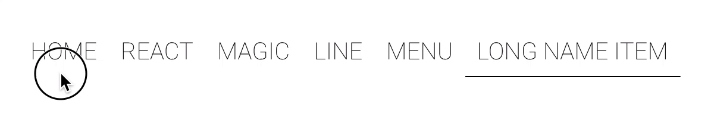

# 🧙‍ React Magic Line Menu

[](https://npmjs.com/package/react-magic-line-menu) [](https://npmjs.com/package/react-magic-line-menu) [](https://travis-ci.org/sandiiarov/react-magic-line-menu) [](https://codecov.io/gh/sandiiarov/react-magic-line-menu) 

<p align="center">
  
</p>

## Getting started

`npm i -S react-magic-line-menu`

or

`yarn add react-magic-line-menu`

```javascript
import MagicLineMenu from 'react-magic-line-menu';

<MagicLineMenu active={0} onItemClick={index => console.log(index)}>
  <div>Home</div>
  <div>Contacts</div>
</MagicLineMenu>;
```

## Props

### active

| Default | Type   |
| :------ | :----- |
| `0`     | number |

The index of active item.

### onItemClick

| Default | Type                    |
| :------ | :---------------------- |
|         | Function(index: number) |

Called when click a menu item.

menuStyle?: Object,
lineStyle?: Object,
menuClassName?: string,
lineClassName?: string,

### menuStyle?

| Default | Type   |
| :------ | :----- |
|         | Object |

Override the inline-styles of the root element.

### lineStyle?

| Default | Type   |
| :------ | :----- |
|         | Object |

Override the inline-styles of the line element.

### menuClassName?

| Default | Type   |
| :------ | :----- |
|         | string |

CSS className of the root element.

### lineStyle?

| Default | Type   |
| :------ | :----- |
|         | string |

CSS className of the line element.

### lineHeight?

| Default | Type   |
| :------ | :----- |
| `1`     | number |

Height of line in px.

### lineColor?

| Default | Type   |
| :------ | :----- |
| `black` | string |

Color of line.

### duration?

| Default | Type   |
| :------ | :----- |
| `500`   | number |

Determines the duration of the animation in milliseconds.

### easing?

| Default  | Type   |
| :------- | :----- |
| `linear` | string |

Determines the duration of the animation in milliseconds.

| constant | accelerate     | decelerate      | accelerate-decelerate |
| :------- | :------------- | :-------------- | :-------------------- |
| linear   | in-cubic       | out-cubic       | in-out-cubic          |
|          | in-quartic     | out-quartic     | in-out-quartic        |
|          | in-quintic     | out-quintic     | in-out-quintic        |
|          | in-exponential | out-exponential | in-out-exponential    |
|          | in-circular    | out-circular    | in-out-circular       |
|          | in-elastic     | out-elastic     | in-out-elastic        |

The amplitude and period of elastic easings can be configured by providing space-separated values.
Amplitude defaults to `1`, period to `0.4`.

```javascript
<MagicLineMenu
  active={0}
  onItemClick={index => console.log(index)}
  easing="out-elastic 1.4 0.2"
>
  <div>Home</div>
  <div>Contacts</div>
</MagicLineMenu>
```

## Browser support

* Chrome 61
* Safari 11.1
* Firefox 57 with `dom.moduleScripts.enabled`
